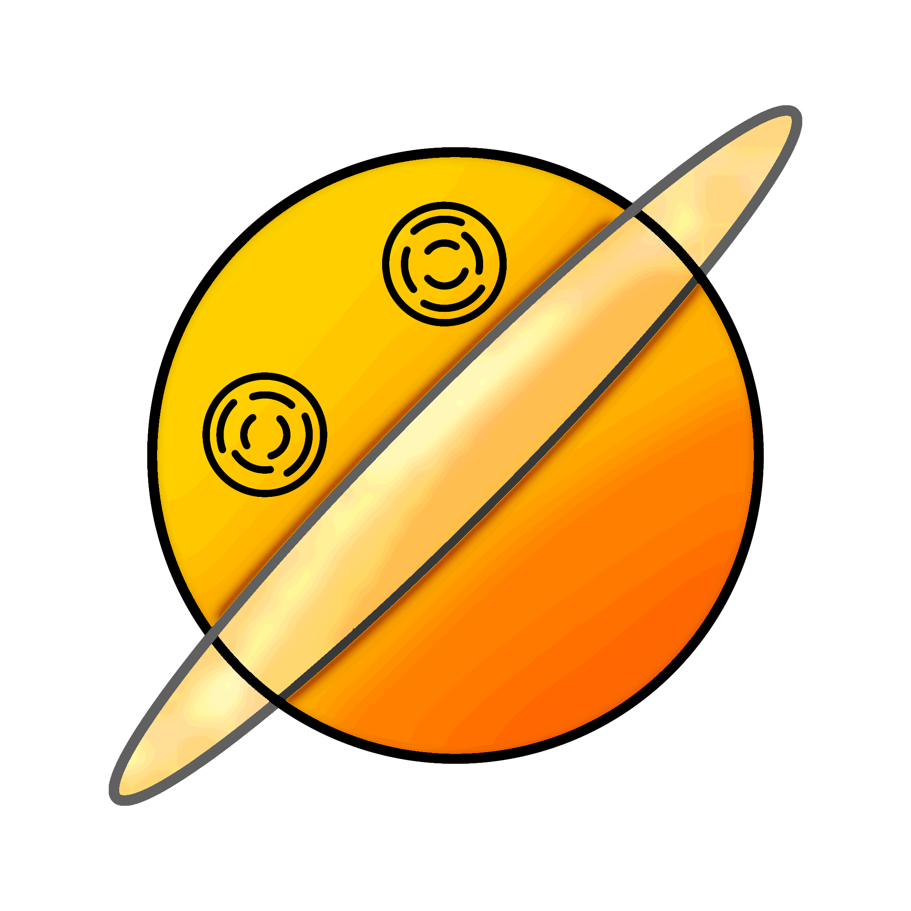
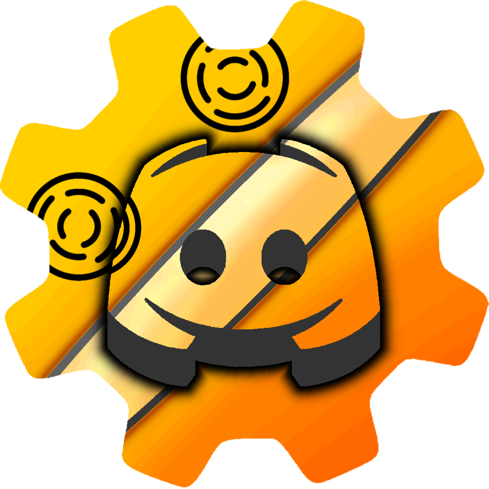

<p align="center">
  
</p>

---

#  ELOS

A scripting runtime for Discord bots. Write bots in a clean, minimal scripting language — no boilerplate, no setup overhead.

---

## Installation

```bash
pip install ELOS
```

---

## Quick Start

Create a file called `main.elos`:

```
login("YOUR_BOT_TOKEN")

onReady:
    log("Bot is online.")

onMessage(message):
    if contains(messageContent(message), "!ping"):
        sendMessage(messageChannel(message), "Pong!")
```

Run it:

```python
import ELOS

ELOS.run("main.elos")
```

---

## Token via Environment Variable

```
login(DISCORD_TOKEN)
```

```bash
export DISCORD_TOKEN="your_token_here"
python main.py
```

---

## Example Bot

```
login("YOUR_BOT_TOKEN")

onReady:
    log("Bot is online.")

onMessage(message):
    msg = messageContent(message)
    ch = messageChannel(message)
    author = messageAuthor(message)
    uid = userID(author)

    if msg == "!balance":
        balance = getUserVar(author, "balance")
        if isNull(balance):
            balance = 1000
            setUserVar(author, "balance", balance)
        newEmbed()
        setEmbedTitle("Balance")
        setEmbedDescription("${username(author)} has **${balance}** coins.")
        setEmbedColor("F1C40F")
        sendEmbed(ch)

    if startsWith(msg, "!avatar"):
        parts = split(msg, " ")
        mention = listGet(parts, 1)
        targetID = replace(replace(replace(mention, "<@", ""), ">", ""), "!", "")
        userData = fetchUser(targetID)
        newEmbed()
        setEmbedTitle("Avatar - ${username(userData)}")
        setEmbedImage(userAvatar(userData))
        setEmbedColor("3498DB")
        sendEmbed(ch)

onMemberJoin(member):
    guild = userGuild(member)
    ch = systemChannel(guild)
    sendMessage(ch, "Welcome ${username(member)}!")
```

---

## API Reference

### Python API

```python
import ELOS

ELOS.run("main.elos")
ELOS.run("main.elos", user_id=12345)
ELOS.run_source(source_string)
ELOS.run_source(source_string, user_id=12345, env={"DISCORD_TOKEN": "..."})
```

---

### Events

| Event | Parameters | Description |
|---|---|---|
| `onReady` | — | Bot connected and ready |
| `onMessage(message)` | message | Message sent in a channel |
| `onMessageDelete(message)` | message | Message deleted |
| `onMessageEdit(before, after)` | before, after | Message edited |
| `onMessageReply(message, target)` | message, target | Message replied to another |
| `onMemberJoin(member)` | member | Member joined the guild |
| `onMemberLeave(member)` | member | Member left the guild |
| `onMemberBan(guild, user)` | guild, user | Member was banned |
| `onMemberUnban(guild, user)` | guild, user | Member was unbanned |
| `onMemberKick(member)` | member | Member was kicked |
| `onMemberUpdate(before, after)` | before, after | Member updated |
| `onJoinVoice(member, before, after)` | member, before, after | Member joined voice |
| `onLeftVoice(member, before, after)` | member, before, after | Member left voice |
| `onVoiceMove(member, before, after)` | member, before, after | Member moved voice channel |
| `onReactionAdd(reaction, user)` | reaction, user | Reaction added |
| `onReactionRemove(reaction, user)` | reaction, user | Reaction removed |
| `onTyping(channel, user, when)` | channel, user, when | User started typing |
| `onBotJoin(guild)` | guild | Bot added to a guild |
| `onBotLeave(guild)` | guild | Bot removed from a guild |
| `onChannelCreate(channel)` | channel | Channel created |
| `onChannelDelete(channel)` | channel | Channel deleted |
| `onChannelEdit(before, after)` | before, after | Channel edited |
| `onRoleCreate(role)` | role | Role created |
| `onRoleDelete(role)` | role | Role deleted |
| `onRoleEdit(before, after)` | before, after | Role edited |
| `onInviteCreate(invite)` | invite | Invite created |
| `onInviteDelete(invite)` | invite | Invite deleted |
| `onBoost(before, after)` | before, after | Server boost changed |
| `onButtonClick(interaction)` | interaction | Button clicked |
| `onSelect(interaction)` | interaction | Select menu used |
| `onModalSubmit(interaction)` | interaction | Modal submitted |
| `onSlash(interaction)` | interaction | Slash command used |
| `onSlashAutocomplete(interaction)` | interaction | Slash autocomplete |
| `onInteraction(interaction)` | interaction | Any interaction |
| `onPlayStart(url)` | url | Audio playback started |
| `onPlayEnd(url)` | url | Audio playback ended |
| `onQueueEnd(guild)` | guild | Audio queue ended |
| `onTimerStart(timer_id)` | timer_id | Timer started |
| `onTimerEnd(timer_id)` | timer_id | Timer ended |

---

### Message Functions

| Function | Description |
|---|---|
| `sendMessage(channel, content)` | Send a text message |
| `replyMessage(message, content)` | Reply to a message |
| `editMessage(message, content)` | Edit a message |
| `deleteMessage(message)` | Delete a message |
| `purge(channel, limit)` | Bulk delete messages |
| `pinMessage(message)` | Pin a message |
| `unpinMessage(message)` | Unpin a message |
| `react(message, emoji)` | Add reaction |
| `removeReact(message, emoji, user)` | Remove reaction |
| `copyMessage(message, channelID)` | Copy message to channel |
| `crosspost(message)` | Crosspost announcement |
| `messageID(message)` | Get message ID |
| `messageContent(message)` | Get message text |
| `messageAuthor(message)` | Get message author |
| `messageChannel(message)` | Get message channel |
| `messageGuild(message)` | Get message guild |
| `messageCreated(message)` | Get creation timestamp |
| `messageJumpURL(message)` | Get jump URL |
| `messageAttachments(message)` | Get attachments list |
| `messageEmbeds(message)` | Get embeds list |
| `messageReactions(message)` | Get reactions list |
| `mentions(message)` | Get mentioned users |
| `mentionRoles(message)` | Get mentioned roles |
| `mentionChannels(message)` | Get mentioned channels |
| `isBotMessage(message)` | Check if sent by a bot |
| `isPinned(message)` | Check if pinned |
| `isEdited(message)` | Check if edited |
| `repliedMessage(message)` | Get the message being replied to |
| `isRepliedMessage(message)` | Check if it is a reply |
| `messageDeleter(message)` | Get user who deleted the message |

---

### Embed Functions

| Function | Description |
|---|---|
| `newEmbed()` | Create a new embed |
| `setEmbedTitle(title)` | Set title |
| `setEmbedDescription(text)` | Set description |
| `setEmbedColor(color)` | Set color (hex string) |
| `setEmbedAuthor(name, iconUrl)` | Set author |
| `setEmbedFooter(text, iconUrl)` | Set footer |
| `setEmbedImage(url)` | Set image |
| `setEmbedThumbnail(url)` | Set thumbnail |
| `addEmbedField(name, value, inline)` | Add field |
| `clearEmbedFields()` | Clear all fields |
| `sendEmbed(channel)` | Send the embed |

---

### User Functions

| Function | Description |
|---|---|
| `userID(user)` | Get user ID |
| `username(user)` | Get username |
| `userTag(user)` | Get full tag |
| `userAvatar(user)` | Get avatar URL |
| `nickname(user)` | Get nickname |
| `userCreated(user)` | Get account creation date |
| `userJoined(user)` | Get guild join date |
| `userRoles(user)` | Get role list |
| `userHighestRole(user)` | Get highest role |
| `isUserInVoice(user)` | Check if in voice |
| `userVoiceChannel(user)` | Get voice channel |
| `userGuild(member)` | Get member's guild |
| `isBot(user)` | Check if user is a bot |
| `isOwner(user)` | Check if server owner |
| `dmUser(user, content)` | Send DM |
| `kick(guild, user, reason)` | Kick member |
| `ban(guild, user, reason)` | Ban member |
| `unban(guild, user)` | Unban user |
| `timeout(guild, user, duration, reason)` | Timeout member |
| `untimeout(guild, user)` | Remove timeout |
| `setNick(guild, userID, nick)` | Set nickname |
| `userHasPermission(user, perm)` | Check permission |
| `userMention(user)` | Get mention string |

---

### Role Functions

| Function | Description |
|---|---|
| `createRole(guild, name, ...options)` | Create a role |
| `deleteRole(role)` | Delete a role |
| `editRole(role, name, color)` | Edit a role |
| `giveRole(member, role)` | Give role to member |
| `removeRole(member, role)` | Remove role from member |
| `hasRole(member, role)` | Check if member has role |
| `roleMembers(role)` | Get members with role |
| `roleID(role)` | Get role ID |
| `roleName(role)` | Get role name |
| `roleColor(role)` | Get role color |
| `rolePosition(role)` | Get role position |
| `moveRole(role, position)` | Move role position |
| `setRolePerm(role, perm, value)` | Set role permission |
| `rolePerm(role, perm)` | Get role permission |
| `rolePerms(role)` | Get all role permissions |

---

### Channel Functions

| Function | Description |
|---|---|
| `createChannel(guild, name)` | Create a channel |
| `deleteChannel(channel)` | Delete a channel |
| `setChannelName(channel, name)` | Rename channel |
| `setChannelTopic(channel, topic)` | Set topic |
| `lockChannel(channel)` | Lock channel |
| `unlockChannel(channel)` | Unlock channel |
| `sendTyping(channel)` | Show typing indicator |
| `channelName(channel)` | Get channel name |
| `channelID(channel)` | Get channel ID |
| `channelGuild(channel)` | Get channel guild |
| `channelByName(guild, name)` | Find channel by name |
| `channelPosition(channel)` | Get channel position |
| `channelCategory(channel)` | Get parent category |
| `allChannels(guildID)` | Get all channels |
| `editChannel(channel, name)` | Edit channel |
| `setChannelType(channel, type)` | Set channel type |
| `setChannelPerm(channel, target, perm, value)` | Set channel permission |

---

### Guild Functions

| Function | Description |
|---|---|
| `guildID(guild)` | Get guild ID |
| `guildName(guild)` | Get guild name |
| `guildOwner(guild)` | Get guild owner |
| `guildMembers(guild)` | Get member list |
| `guildChannels(guild)` | Get channel list |
| `guildRoles(guild)` | Get role list |
| `guildIcon(guild)` | Get guild icon URL |
| `allServers()` | Get all guilds bot is in |
| `allGuildUsers(guild)` | Get all members |
| `systemChannel(guild)` | Get system channel |
| `setGuildName(guild, name)` | Set guild name |
| `setGuildIcon(guild, url)` | Set guild icon |
| `leaveGuild(guild)` | Make bot leave guild |
| `randomUser(guild)` | Get random member |
| `randomChannel(guild, type)` | Get random channel |

---

### Slash Command Functions

| Function | Description |
|---|---|
| `createSlash(name, description)` | Create slash command definition |
| `addSlashOption(cmd, name, desc, type, required)` | Add option |
| `addSlashSubcommand(cmd, name, desc)` | Add subcommand |
| `registerSlash(guild, cmd)` | Register with Discord |
| `deleteSlash(guild, name)` | Delete a slash command |
| `replySlash(interaction, content)` | Reply to slash command |
| `replySlashEphemeral(interaction, content)` | Ephemeral reply |
| `replySlashEmbed(interaction, embed)` | Reply with embed |
| `deferSlash(interaction)` | Defer response |
| `editSlashReply(interaction, content)` | Edit reply |
| `slashName(interaction)` | Get command name |
| `slashOption(interaction, name)` | Get option value |
| `slashSubcommand(interaction)` | Get subcommand name |
| `interactionUser(interaction)` | Get interaction user |
| `interactionChannel(interaction)` | Get interaction channel |
| `replyAutocomplete(interaction, choices)` | Send autocomplete choices |

---

### Button / UI Functions

| Function | Description |
|---|---|
| `newView(viewID)` | Create button view |
| `addButton(viewID, buttonID, label, style, emoji, disabled)` | Add button |
| `addLinkButton(viewID, buttonID, label, url)` | Add link button |
| `sendView(channel, content, viewID)` | Send message with buttons |
| `replyWithView(content, viewID)` | Reply with buttons |
| `clearView(viewID)` | Clear all buttons |
| `removeButton(viewID, buttonID)` | Remove a button |
| `buttonID()` | Get clicked button ID |
| `buttonUser()` | Get user who clicked |
| `replyButton(interaction, message)` | Reply to button click |
| `editViewButton(viewID, buttonID, label, style, disabled)` | Edit a button |

---

### Select Menu Functions

| Function | Description |
|---|---|
| `newSelectList(selectID, placeholder)` | Create select menu |
| `addSelectListOption(selectID, label, value)` | Add option |
| `selectValues()` | Get selected values |
| `selectID()` | Get select menu ID |
| `replySelect(interaction, message)` | Reply to selection |

---

### Modal Functions

| Function | Description |
|---|---|
| `newModal(modalID, title)` | Create a modal |
| `addTextInput(modalID, inputID, label, placeholder, required, minLength, maxLength)` | Add text input |
| `sendModal(modalID)` | Send modal to user |
| `modalInputValue(inputID)` | Get input value |
| `modalInputs()` | Get all inputs |
| `replyModal(interaction, message)` | Reply to modal submit |

---

### Storage / Variable Functions

| Function | Description |
|---|---|
| `setVar(key, value)` | Set a global variable |
| `getVar(key)` | Get a global variable |
| `deleteVar(key)` | Delete a global variable |
| `hasVar(key)` | Check if variable exists |
| `setUserVar(user, key, value)` | Set user-scoped variable |
| `getUserVar(user, key)` | Get user-scoped variable |
| `deleteUserVar(user, key)` | Delete user variable |
| `hasUserVar(user, key)` | Check user variable |
| `setServerVar(guild, key, value)` | Set guild-scoped variable |
| `getServerVar(guild, key)` | Get guild-scoped variable |
| `setChannelVar(channel, key, value)` | Set channel-scoped variable |
| `getChannelVar(channel, key)` | Get channel-scoped variable |

---

### List Functions

| Function | Description |
|---|---|
| `newList(name)` | Create a list |
| `addToList(value, name)` | Add item to list |
| `removeFromList(value, name)` | Remove item from list |
| `getList(name)` | Get entire list |
| `clearList(name)` | Clear list |
| `listLength(name)` | Get list length |
| `listHas(name, value)` | Check if value exists in list |

---

### HTTP Functions

| Function | Description |
|---|---|
| `httpGet(url)` | HTTP GET request |
| `httpPost(url, body)` | HTTP POST request |
| `httpGetJson(url)` | GET and parse JSON |
| `httpPostJson(url, body)` | POST JSON |
| `httpPut(url, body)` | HTTP PUT request |
| `httpDelete(url)` | HTTP DELETE request |
| `httpRequest(method, url, headers, body)` | Custom request |
| `responseStatus(response)` | Get status code |
| `responseBody(response)` | Get response body |
| `responseJSON(response)` | Get parsed JSON |
| `isResponseOk(response)` | Check if 2xx |
| `setHttpHeader(key, value)` | Set default header |
| `encodeUrl(text)` | URL encode string |
| `decodeUrl(text)` | URL decode string |

---

### File / JSON Functions

| Function | Description |
|---|---|
| `readFile(path)` | Read file contents |
| `writeFile(path, content)` | Write file |
| `jsonCreate(name)` | Create JSON store |
| `jsonSet(name, key, value)` | Set JSON value |
| `jsonGet(name, key)` | Get JSON value |
| `jsonRemove(name, key)` | Remove JSON key |
| `jsonGetAll(name)` | Get all data |
| `jsonHasKey(name, key)` | Check key exists |
| `jsonKeys(name)` | Get all keys |
| `jsonValues(name)` | Get all values |
| `jsonSize(name)` | Get entry count |
| `jsonClear(name)` | Clear all data |
| `jsonDelete(name)` | Delete JSON store |
| `jsonEncode(value)` | Encode to JSON string |
| `jsonDecode(text)` | Decode JSON string |

---

### Audio Functions

| Function | Description |
|---|---|
| `joinVoice(channel)` | Join voice channel |
| `leaveVoice(channel)` | Leave voice channel |
| `play(url)` | Play audio from URL |
| `stop()` | Stop playback |
| `skip()` | Skip current track |
| `pauseAudio()` | Pause playback |
| `resumeAudio()` | Resume playback |
| `setVolume(level)` | Set volume (0-100) |
| `getVolume()` | Get current volume |
| `isPlaying()` | Check if playing |
| `isPaused()` | Check if paused |
| `addQueue(url)` | Add to queue |
| `getQueue()` | Get queue list |
| `clearQueue()` | Clear queue |
| `queueLength()` | Get queue length |
| `loop(value)` | Toggle loop |
| `loopQueue(value)` | Toggle queue loop |
| `nowPlaying()` | Get current track |
| `tts(guild, text, language)` | Text to speech |

---

### Image Functions

| Function | Description |
|---|---|
| `newImage(id, width, height)` | Create blank image |
| `fillColor(id, color)` | Fill with color |
| `addImage(id, url, x, y, width, height)` | Draw image |
| `addCircleImage(id, url, x, y, size)` | Draw circular image |
| `addText(id, text, x, y, size, color, fontUrl)` | Draw text |
| `addTextCentered(id, text, x, y, size, color)` | Draw centered text |
| `resizeImage(id, width, height)` | Resize image |
| `cropImage(id, x, y, width, height)` | Crop image |
| `rotateImage(id, degrees)` | Rotate image |
| `addRoundedRect(id, x, y, width, height, radius, color)` | Draw rounded rectangle |
| `setImageOpacity(id, opacity)` | Set opacity |
| `uploadImage(id, channel)` | Upload to channel |
| `imageURL(id)` | Get image URL |
| `deleteImage(id)` | Delete image from memory |

---

### Bot Status Functions

| Function | Description |
|---|---|
| `setPlaying(text)` | Set "Playing ..." status |
| `setWatching(text)` | Set "Watching ..." status |
| `setListening(text)` | Set "Listening to ..." status |
| `setStreaming(text, url)` | Set "Streaming ..." status |
| `setStatus(status)` | Set online/idle/dnd/invisible |
| `clearStatus()` | Clear activity |

---

### String Functions

| Function | Description |
|---|---|
| `lower(text)` | Lowercase |
| `upper(text)` | Uppercase |
| `replace(text, old, new)` | Replace substring |
| `split(text, separator)` | Split to list |
| `join(list, separator)` | Join list to string |
| `contains(text, value)` | Check if contains |
| `startsWith(text, value)` | Check prefix |
| `endsWith(text, value)` | Check suffix |
| `length(value)` | Get length |
| `getCharacters(text, start, end)` | Get substring |

---

### Math Functions

| Function | Description |
|---|---|
| `random(min, max)` | Random integer |
| `randomSelect(val1, val2, ...)` | Pick random value |
| `round(number)` | Round number |
| `floor(number)` | Floor |
| `ceil(number)` | Ceiling |
| `abs(number)` | Absolute value |

---

### Time Functions

| Function | Description |
|---|---|
| `wait(duration)` | Pause (`1s`, `500ms`, `2m`) |
| `unixTime()` | Current Unix timestamp |
| `timestamp()` | Current timestamp |
| `formatTime(unix)` | Format Unix time |
| `seconds(duration)` | Convert duration to seconds |
| `createTimer(id, time)` | Create a timer |

---

### Type Functions

| Function | Description |
|---|---|
| `str(value)` | Convert to string |
| `int(value)` | Convert to integer |
| `float(value)` | Convert to float |
| `isNumber(value)` | Check if number |
| `toNumber(value)` | Convert to number |

---

### Webhook Functions

| Function | Description |
|---|---|
| `createWebhook(channelID, name)` | Create webhook |
| `deleteWebhook(webhook)` | Delete webhook |
| `sendWebhook(webhook, content)` | Send message via webhook |
| `sendWebhookMessage(webhook, content, username, avatarUrl)` | Send with custom name/avatar |
| `webhookID(webhook)` | Get webhook ID |
| `webhookURL(webhook)` | Get webhook URL |
| `editWebhook(webhook, name)` | Edit webhook name |

---

### Invite Functions

| Function | Description |
|---|---|
| `createInvite(channel, maxAge, maxUses)` | Create invite |
| `deleteInvite(invite)` | Delete invite |
| `inviteCode(invite)` | Get invite code |
| `inviteUses(invite)` | Get use count |
| `inviteCreator(invite)` | Get invite creator |

---

### Emoji Functions

| Function | Description |
|---|---|
| `emojiURL(emoji)` | Get emoji image URL |
| `serverEmojis(guild)` | Get all server emojis |
| `createEmoji(guild, name, imageUrl)` | Create custom emoji |
| `emojiID(emoji)` | Get emoji ID |
| `emojiName(emoji)` | Get emoji name |
| `reactionCount(message, emoji)` | Get reaction count |
| `clearReactions(message)` | Remove all reactions |

---

## Console Output

- ⚪ **White** — normal output
- 🟡 **Yellow** — warnings (rate limits, undefined variables)
- 🔴 **Red** — errors (wrong arguments, API failures, runtime exceptions)

---

## License

Licensed under the Apache License 2.0. See the [LICENSE](LICENSE) file for details.
ELOS™ is a trademark of MyLittleElement.

The ELOS name, logo, and branding may not be used
for modified or unofficial versions without permission.

 
